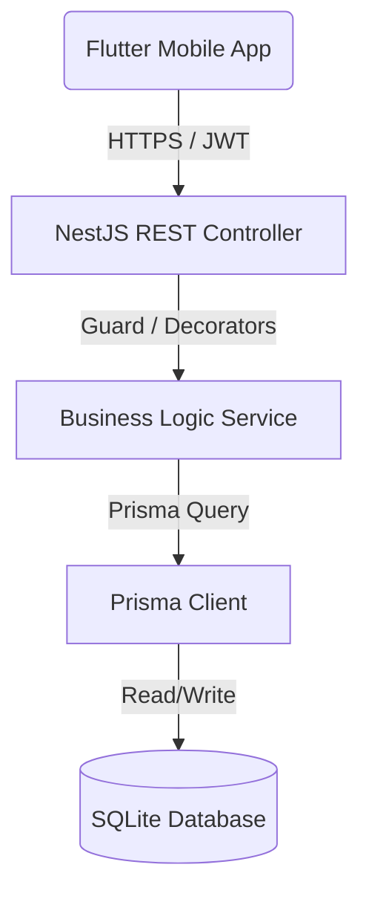

# 🌌 TripMate Backend Services — Enterprise Vibe API

Welcome to the **TripMate Backend Engine**! This progressive, highly-scalable backend service powers the entire TripMate ecosystem. Built using the enterprise-grade NestJS framework, Prisma ORM, and SQLite, it acts as the centralized authority for synchronized real-time group travel, gamified stats, and interactive social environments.

[](https://nestjs.com)
[](https://www.typescriptlang.org/)
[](https://prisma.io)
[](LICENSE)

---

## 🛠️ Architecture & Core Technologies

The system is constructed with a highly decoupled, modular design pattern to ensure clean separation of concerns and robust maintainability.

*   **Runtime & Framework**: [Node.js](https://nodejs.org/) & [NestJS](https://nestjs.com/) (TypeScript)
*   **Database & ORM**: [SQLite](https://sqlite.org/) with [Prisma ORM](https://prisma.io/)
*   **Authentication**: [JSON Web Tokens (JWT)](https://jwt.io/) & [Supabase Auth-Ready Gateway](https://supabase.com/)
*   **API Specification**: [Swagger (OpenAPI 3.0)](https://swagger.io/)
*   **Code Quality**: ESLint, Prettier, strict linting rules



---

## 🚀 Key Modules & Endpoints

### 1. 🛡️ Authentication & Authorization (`/api/v1/auth`)
*   `POST /auth/register` - Create a new user / phượt thủ alter ego profile.
*   `POST /auth/login` - Securely log in using Supabase authorization identifiers.

### 2. 👤 User Profiles & Social Links (`/api/v1/users`)
*   `GET /users/me` - Fetch current user's profile detail (Vibes, Bio, Avatar, Level, and XP).
*   `PATCH /users/me` - Update profile customized options (including dynamic background theme).
*   `GET /users/me/stats` - Fetch phượt thủ performance indicators (distance traveled, squad reputation index, chaos score).
*   `GET /users/me/badges` - Fetch unlocked and locked travel badges/trophies.
*   `GET /users/me/social-links` & `PATCH /users/me/social-links` - Retrieve and sync Instagram, TikTok, and Facebook links.
*   `POST /users/me/presence` - Real-time location tracking for group travel safety.

### 3. 🛍️ Marketplaces & Sticker Stores
*   `GET /users/theme-marketplace` - View active premium visual themes catalog.
*   `GET /users/sticker-store` - Browse available stickers to use in group chats.
*   `GET /users/me/stickers` - Retrieve user's personal owned sticker inventory.
*   `POST /users/me/stickers/purchase` - Purchase expressive stickers using earned phượt thủ XP.

---

## ⚙️ Quick Start Guide

### 1. Prerequisite Installations
*   [Node.js (v18 or newer)](https://nodejs.org/)
*   [npm](https://www.npmjs.com/)

### 2. Environment Configurations
Clone or copy the default environment file `.env.local` to `.env` in the root backend directory:
```env
DATABASE_URL="file:./dev.db"
JWT_SECRET="tripmate-super-secret-chaotic-jwt-key"
PORT=3000
```

### 3. Database Initialization
Instantiate the SQLite database schema and generate Prisma client mappings:
```bash
# Install NPM dependencies
$ npm install

# Run database migrations
$ npx prisma migrate dev --name init

# Generate Prisma client
$ npx prisma generate
```

### 4. Running the Development Server
Launch the server in watch mode:
```bash
$ npm run start:dev
```
The server will boot and listen at **`http://localhost:3000/api/v1`**.
*   Explore full interactive **API Documentation** via Swagger at **`http://localhost:3000/api`**.

---

## 📁 Repository Directory Layout
```text
TripMate_be/
├── src/
│   ├── common/         # Guards, Decorators, Interceptors
│   ├── prisma/         # Prisma DB context client
│   └── modules/        # Decoupled business modules
│       ├── auth/       # Supabase and Local JWT flow
│       └── users/      # Profiles, Badges, Stores, Stats
├── prisma/
│   ├── schema.prisma   # Declarative database model schema
│   └── migrations/     # Versioned SQL migration files
├── package.json        # Project manifest
└── tsconfig.json       # TypeScript options compiler config
```
